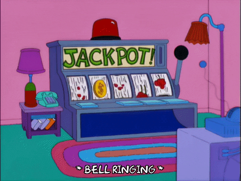

 
  

  <h3>Desarrolladores: Mateo Achá y Arnau Gil :man_technologist: :man_technologist:</h3>

<h2>Menú :game_die:</h2>

En primer lugar, el casino te preguntará si tienes más de 18 años, luego tendrás que introducir tu nombre. Después de introducir tu nombre, tendrás que depositar la cantidad de dinero que deseas apostar. Después de eso, se desplegará un menú con 3 opciones entre las cuales podrás elegir: Ruleta, Blackjack y Slot.

<h2>Blackjack :spades::hearts::diamonds::clubs:</h2>

Al principio, se mostrará otro menú que te dará opciones de apuesta:

<ul>
  <li>0.2$</li>
  <li>0.4$</li>
  <li>0.8$</li>
  <li>1$</li>
  <li>2$</li>
  <li>5$</li>
  <li>10$</li>
  <li>50$</li>
  <li>100$</li>
</ul>

En el blackjack, el objetivo es vencer la mano del crupier sin pasarse de 21. Una mano con un total superior a 21 se considera "bust" o "broke", lo que resulta en una pérdida automática.

<strong>Comenzando la Ronda:</strong> Los jugadores realizan sus apuestas en áreas designadas en la mesa. A cada jugador y al crupier se le reparten dos cartas. Las cartas de los jugadores se reparten boca arriba, mientras que el crupier tiene una carta boca arriba y otra boca abajo.

<strong>Valores de las Cartas:</strong> Las cartas numeradas valen su valor nominal, las cartas de figuras (Jota, Reina, Rey) valen cada una 10 puntos y los Ases pueden valer 1 o 11 puntos, según lo que beneficie más al jugador.

<strong>Mejor Mano:</strong> La mejor mano en el blackjack se llama "blackjack", que consiste en un As y una carta con un valor de 10 (10, Jota, Reina o Rey). Un blackjack generalmente paga a probabilidades de 3 a 2.

<strong>Acciones del Jugador:</strong> Después de recibir sus dos cartas iniciales, los jugadores tienen varias opciones:

<ul>
  <li>Pedir (Hit): Solicitar una carta adicional para mejorar su mano.</li>
  <li>Plantarse (Stand): Rechazar cartas adicionales y conservar su mano actual.</li>
 
</ul>

<strong>Turno del Crupier:</strong> Una vez que todos los jugadores hayan completado sus acciones, el crupier revela su carta boca abajo. El crupier debe pedir carta hasta que su mano alcance un total de 17 o más. Es posible que al crupier se le exija pedir carta en un "17 suave" (una mano que contiene un As valorado en 11).

<strong>Ganar y Perder:</strong>

<ul>
  <li>Si la mano de un jugador vence a la del crupier sin exceder 21, el jugador gana el equivalente a su apuesta.</li>
  <li>Si la mano del jugador supera 21, se considera una "bust", y el jugador pierde su apuesta.</li>
  <li>Si el jugador y el crupier tienen el mismo total de mano (un empate), se devuelve la apuesta del jugador.</li>
  <li>Si el jugador tiene un blackjack y el crupier no, el jugador gana 1.5 veces su apuesta original.</li>
  <li>Si tanto el jugador como el crupier tienen blackjack, es un empate, y se devuelve la apuesta del jugador.</li>
</ul>

<strong>Seguro (Insurance):</strong> Los jugadores tienen la opción de comprar un seguro si la carta visible del crupier es un As. Las apuestas de seguro se pagan 2 a 1 si el crupier tiene blackjack, pero si el crupier no tiene blackjack, se pierde la apuesta de seguro.

<h2>SLOT (Mighty Symbols) :slot_machine:</h2>

Consiste en generar 3 números aleatorios en línea como una típica máquina tragamonedas, y según la combinación que toque, ganarás más o menos, o perderás.

Antes de todo, habrá un menú en el cual tendrás que elegir la cantidad de apuesta:

<ul>
  <li>0.2$</li>
  <li>0.4$</li>
  <li>0.8$</li>
  <li>1$</li>
  <li>2$</li>
  <li>5$</li>
  <li>10$</li>
  <li>50$</li>
  <li>100$</li>
</ul>

En el juego habrá diversos símbolos que, según la combinación, darán una cierta cantidad de ganancias (de menos a más valor):

<ul>
  <li>0</li>
  <li>B</li>
  <li>A</li>
  <li>&</li>
  <li>#</li>
  <li>@</li>
  <li>$</li>
</ul>

Estas son las combinaciones ganadoras (de menor a mayor valor), ganarás cuando en la fila de 3 números haya 2 o 3 números iguales:

<ul>
  <li>00 = 0.5X</li>
  <li>BB = 0.8X</li>
  <li>AA = 1X</li>
  <li>&& = 1.5X</li>
  <li>## = 2X</li>
  <li>@@ = 2.5X</li>
  <li>$$ = 4X</li>
</ul>

Combinaciones de mayor valor:

<ul>
  <li>000 = 1X</li>
  <li>BBB = 1.5X</li>
  <li>AAA = 2X</li>
  <li>&&& = 3X</li>
  <li>### = 5X</li>
  <li>@@@ = 10X</li>
  <li>$$$ = 50X</li>
</ul>

<h2>ROULETTE (RiZzRoulette) :black_circle::red_circle::green_circle:</h2>

Habrá 37 números, del 1 al 36, 18 en negro y 18 en rojo, y el 0 en verde. Habrá diversas opciones de apuesta, que son las siguientes:

<ul>
  <li>Color rojo o negro (2): Multiplicador de 2x</li>
  <li>Par o impar (2): Multiplicador 2x</li>
  <li>Número (37): Multiplicador 30x</li>
  <li>Cuadrante (3): Multiplicador 3x</li>
</ul>

El programa no tendrá visualmente una ruleta, pero sí tendrá un tablero donde estarán todas las opciones de apuesta.

El programa hará lo siguiente:

Mostrará un menú con las opciones de cantidad de dinero a apostar.
El usuario selecciona la opción.
Se mostrará el tablero, y el programa le pedirá al usuario en qué quiere apostar: número, cuadrante, etc.
El usuario selecciona la opción.
Volverá a mostrar un menú con otra opción más específica (por ejemplo, si ha escogido apostar en un cuadrante, entonces el segundo menú le preguntará en qué cuadrante).
El usuario selecciona, y la "ruleta" girará (de forma empírica).
Dependiendo del resultado, se mostrará un mensaje de WIN o LOSE, y se restará o sumará al saldo.

    

